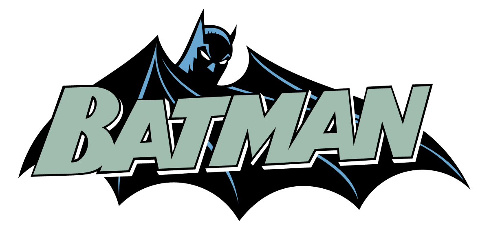
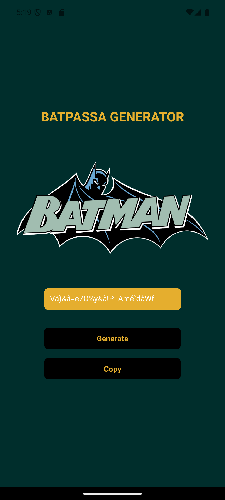

# 🦇 BatPassa Generator



O **BatPassa Generator** é um app simples e divertido feito em **React Native** com **Expo** que gera senhas seguras e aleatórias — com um toque do estilo do Cavaleiro das Trevas 🦇.

---

## 📱 Sobre o Projeto

Esse é o **primeiro aplicativo que desenvolvi com React Native** e já posso dizer que foi uma experiência incrível! A ideia surgiu da necessidade de criar senhas fortes de forma rápida e divertida — e, claro, com a temática do Batman para deixar tudo mais interessante 😄.

---

## 🚀 Tecnologias Utilizadas

- [React Native](https://reactnative.dev/)
- [Expo](https://expo.dev/)
- [TypeScript](https://www.typescriptlang.org/)
- [Toastify React Native](https://www.npmjs.com/package/toastify-react-native)
- [Expo Clipboard](https://docs.expo.dev/versions/latest/sdk/clipboard/)

Essas tecnologias ajudaram bastante no meu desenvolvimento pessoal. Trabalhar com **Expo**, por exemplo, facilitou muito a criação e o teste do app, tornando todo o processo mais acessível para quem está começando no mundo mobile. Além disso, explorar a estrutura de componentes, estilização e integração de bibliotecas foi essencial para aprender na prática.

---

## ⚙️ Como Rodar o Projeto

### Pré-requisitos

Você vai precisar ter instalado em sua máquina:

- [Node.js](https://nodejs.org/)
- [Expo CLI](https://docs.expo.dev/get-started/installation/)
- Um emulador Android/iOS ou o app **Expo Go** no celular

### Instalação

```bash
# Clone o repositório
git clone https://github.com/seu-usuario/batpassa-generator.git

# Entre na pasta do projeto
cd batpassa-generator

# Instale as dependências
npm install

# Rode o app
npm start
- Escanear o QR code com o Expo Go no seu celular
- Ou pressionar a no terminal para rodar em um emulador Android
- Ou w para abrir no navegador
```

## ✨ Funcionalidades

- Geração de senha aleatória com caracteres especiais, números e letras (inclusive com acentos)
- Copiar a senha para a área de transferência com apenas um toque
- Feedback visual com toast de sucesso ao copiar

## Tela do App



---

## 🤝 Contribuindo

- Este projeto foi feito para aprendizado, mas se você quiser contribuir com melhorias, fique à vontade para fazer um fork e mandar uma PR! Toda ajuda é bem-vinda 🙌

## 💡 Aprendizados

Durante o desenvolvimento, aprendi bastante sobre:

- Componentização no React Native
- Estilização com StyleSheet
- Uso de bibliotecas externas como expo-clipboard e toastify-react-native
- Organização de pastas e reutilização de componentes (como o botão)

## 📬 Contato

Se quiser trocar uma ideia ou dar algum feedback, me chama lá no [Linkeding](https://www.linkedin.com/in/ryanwilldaros/) 😄

Feito com 💛 e um pouco de escuridão 🦇 por [Ryan Will](https://www.linkedin.com/in/ryanwilldaros/).
